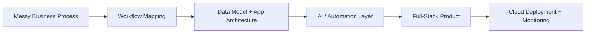
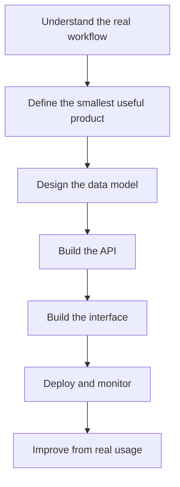

# Aaron George

---

## Building practical AI tools for real business workflows

I’m a full-stack engineer focused on **AI-enabled software, automation tools, and cloud-backed business systems**.

I work mainly with **React, TypeScript, Node.js, Express, MongoDB, PostgreSQL, Docker, and Azure**. My focus is building useful systems that solve operational problems, not just AI demos. That includes document automation, internal tools, admin dashboards, real-time systems, workflow copilots, and production-ready business platforms.

I enjoy the full journey from messy requirements to working software: understanding the business problem, designing the data model, building the frontend and backend, deploying the system, and improving it through real usage.

---

## What I build

| Area | Focus |
|---|---|
| **AI-assisted tools** | Resume editors, document generators, workflow copilots, structured output systems |
| **Business platforms** | Admin portals, dashboards, booking systems, role-based systems, reporting tools |
| **Automation systems** | Tools that reduce repetitive admin work and improve operational speed |
| **Real-time apps** | WebSocket-based dashboards, technician tracking, live updates, notifications |
| **Cloud deployments** | Azure, Docker, Nginx, PM2, CI/CD, storage, monitoring, production hardening |

---

## AI product workflow

---

## Tech stack

---

## What I’m building in public

I’m rebuilding this GitHub around practical AI and full-stack engineering projects. The goal is to show complete systems, not just isolated code snippets.

| Project type | What it demonstrates |
|---|---|
| **AI productivity tools** | Prompt workflows, document editing, structured generation, useful AI interfaces |
| **Business dashboards** | React interfaces, role-based access, reporting, operational workflows |
| **Automation systems** | Turning repetitive manual work into reliable software |
| **Cloud-backed apps** | APIs, databases, Docker, deployment, CI/CD, and production setup |

---

## How I approach engineering

---

## Current focus

- Building AI-assisted tools that solve real workflow problems
- Creating full-stack projects with clean READMEs and architecture notes
- Turning business operations into usable dashboards and automation systems
- Improving deployment, testing, observability, and system design

---

## Project principles

| Principle | What it means |
|---|---|
| **Useful before impressive** | I prefer AI tools that solve real workflow problems over flashy demos |
| **Clear architecture** | I care about readable code, clean APIs, and maintainable project structure |
| **Production mindset** | Deployment, security, testing, and monitoring are part of the build |
| **Business context first** | Good software starts with understanding the actual operational problem |

---

## GitHub activity

---

## Connect

