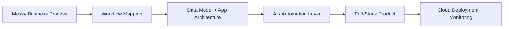
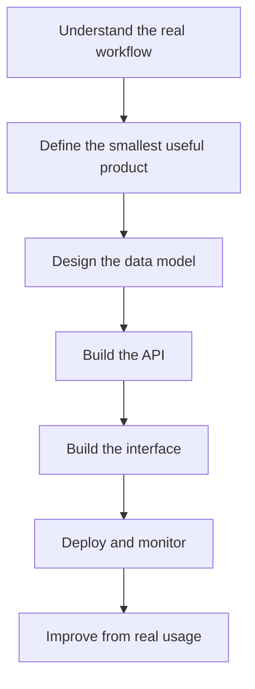

# Aaron George

---

## Building practical AI tools for real business workflows

I’m a full-stack engineer focused on **AI-enabled software, automation tools, and cloud-backed business systems**.

I work mainly with **React, TypeScript, Node.js, Express, MongoDB, PostgreSQL, Docker, and Azure**. My focus is building useful systems that solve operational problems, not just AI demos. That includes document automation, internal tools, admin dashboards, real-time systems, workflow copilots, and production-ready business platforms.

I enjoy the full journey from messy requirements to working software: understanding the business problem, designing the data model, building the frontend and backend, deploying the system, and improving it through real usage.

---

## What I build

| Area | Focus |
|---|---|
| **AI-assisted tools** | Resume editors, document generators, workflow copilots, structured output tools |
| **Business platforms** | Admin portals, dashboards, booking systems, role-based systems, reporting tools |
| **Automation systems** | Tools that reduce repetitive admin work and improve operational speed |
| **Real-time apps** | WebSocket-based dashboards, technician tracking, live updates, notifications |
| **Cloud deployments** | Azure, Docker, Nginx, PM2, CI/CD, storage, monitoring, production hardening |

---

## AI product workflow

---

## Tech stack

---

## Featured builds

<table>
  <tr>
    <td width="33%">
      <h3>AI Resume Editor</h3>
      
A personal tool for tailoring CVs and cover letters while keeping them structured, readable, and ATS-friendly.

      
<strong>Focus:</strong> AI writing workflows, document editing, structured generation

      
<strong>Stack:</strong> React, Node.js, TypeScript

    </td>
    <td width="33%">
      <h3>AI Requirements Generator</h3>
      
Turns rough business ideas into MVP scopes, feature lists, technical requirements, and implementation plans.

      
<strong>Focus:</strong> Product thinking, prompt workflows, full-stack delivery

      
<strong>Stack:</strong> TypeScript, Express, MongoDB

    </td>
    <td width="33%">
      <h3>Operations Dashboard</h3>
      
A role-based dashboard for jobs, customers, staff, inventory, reporting, and internal business workflows.

      
<strong>Focus:</strong> Admin systems, APIs, dashboards, deployment

      
<strong>Stack:</strong> React, RTK Query, Node.js, Azure

    </td>
  </tr>
</table>

---

## Current focus

- Building public AI-assisted tools with clean READMEs, screenshots, and architecture notes
- Turning real business workflows into full-stack products
- Improving system design, testing, deployment, and observability
- Creating practical software that combines AI, automation, and business operations

---

## How I approach engineering

---

## Project principles

| Principle | What it means |
|---|---|
| **Useful before impressive** | I prefer AI tools that solve real workflow problems over flashy demos |
| **Clear architecture** | I care about readable code, clean APIs, and maintainable project structure |
| **Production mindset** | Deployment, security, testing, and monitoring are part of the build |
| **Business context first** | Good software starts with understanding the actual operational problem |

---

## GitHub activity

---

## Connect

