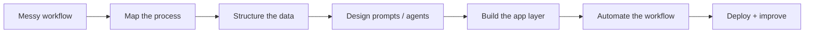
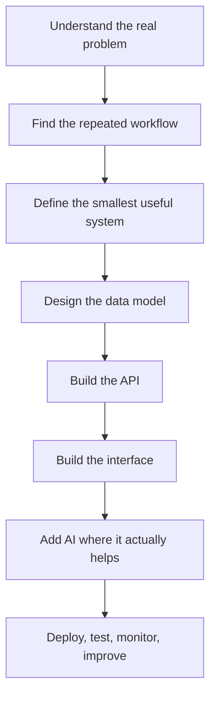

<div align="center">

<pre>
╔══════════════════════════════════════════════════════════════╗
║                                                              ║
║   AARON GEORGE                                               ║
║   full-stack engineer / ai-enabled systems / automation       ║
║                                                              ║
╚══════════════════════════════════════════════════════════════╝
</pre>


</div>

---

## `./boot`

```txt
> initializing profile...
> loading builder context...
> focus: AI-enabled business software
> stack: React / TypeScript / Node.js / Python / Azure
> mode: practical, fast-moving, production-minded
```

I’m a full-stack engineer building **AI-enabled tools, automation systems, and cloud-backed business platforms**.

I’m interested in the kind of software that sits close to real operations: internal dashboards, document workflows, business automation, admin systems, real-time tracking, and AI tools that help people move faster without adding complexity.

My focus is not just building AI demos. I care about turning messy business problems into working systems with clean interfaces, useful automation, solid APIs, and production-ready deployment.

---

## `./what-i-build`

| Area | What I build |
|---|---|
| **AI-assisted tools** | Resume editors, document generators, structured output tools, workflow copilots |
| **Business automation** | Tools that reduce manual admin work, repetitive reporting, and operational bottlenecks |
| **Internal platforms** | Admin portals, dashboards, booking systems, job tracking, role-based workflows |
| **Real-time systems** | WebSocket dashboards, technician tracking, live updates, notifications |
| **Cloud-backed products** | APIs, databases, Dockerized services, Azure deployments, CI/CD pipelines |

---

## `./ai-systems-map`



---

## `./core-stack`

<div align="center">


</div>

---

## `./ai-toolkit`

<div align="center">


</div>

---

## `./current-focus`

```txt
[01] building AI-assisted tools that solve real workflow problems
[02] creating full-stack products around business operations
[03] experimenting with agents, RAG, structured outputs, and automation
[04] improving deployment, testing, observability, and system design
[05] making public repos that show the thinking behind the build
```

---

## `./how-i-think`



---

## `./engineering-principles`

| Principle | Meaning |
|---|---|
| **Useful before impressive** | I prefer AI tools that solve actual problems over demos that only look good |
| **Business context first** | Good software starts with understanding the workflow, not picking the stack |
| **Simple systems win** | The best architecture is usually the one people can actually maintain |
| **Production mindset** | Deployment, testing, monitoring, and security are part of the build |
| **AI as leverage** | AI should reduce friction, speed up decisions, or automate repetitive work |

---

## `./build-log`

```txt
recent interests:
  - AI resume and cover letter editing workflows
  - requirements-to-MVP generation tools
  - internal dashboards for operations-heavy businesses
  - real-time technician and job tracking systems
  - RAG and structured output pipelines
  - n8n-style workflow automation for business processes
```

---

## `./connect`

<table>
  <tr>
    <td width="58%">

```txt
$ ./connect --with aaron

github   : public builds, experiments, engineering notes
linkedin : software, AI workflows, product thinking
email    : roles, collaborations, projects, useful ideas

status   : building at the intersection of AI, full-stack
           engineering, automation, and business operations
```

</td>
<td width="42%" align="center">

<a href="https://github.com/ajgeorge">
  
</a>

<br/><br/>

<a href="https://www.linkedin.com/in/ajosgeorge/">
  
</a>

<br/><br/>

<a href="mailto:aaronjosgeorge@gmail.com">
  
</a>

</td>
  </tr>
</table>

---

<div align="center">

```txt
> end of file
> still building
```

</div>
