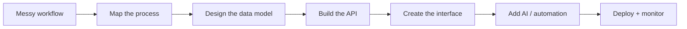

<pre>
╭────────────────────────────────────────────────────────────╮
│                                                            │
│   AARON GEORGE                                             │
│   AI-enabled software / automation / cloud systems          │
│                                                            │
╰────────────────────────────────────────────────────────────╯
</pre>

---

## ./profile

<table>
  <tr>
    <td width="55%">

<pre>
user        : ajgeorge
role        : full-stack engineer
focus       : AI-enabled business software
stack       : React / TypeScript / Node.js / Azure
build style : practical, clean, production-minded
</pre>

</td>
<td width="45%">

I build full-stack systems that turn messy business workflows into usable software.

My current focus is **AI-assisted tools**, internal platforms, automation systems, and cloud-backed products that solve real operational problems.

</td>
  </tr>
</table>

---

## ./what-i-build

| Area | What I care about |
|---|---|
| **AI-assisted tools** | Document editors, workflow copilots, structured output systems, internal automation |
| **Business platforms** | Admin portals, dashboards, booking systems, reporting tools, role-based workflows |
| **Real-time systems** | WebSocket dashboards, live updates, technician tracking, notifications |
| **Cloud-backed apps** | APIs, databases, Docker, Nginx, CI/CD, Azure deployment, monitoring |
| **Product engineering** | Turning vague requirements into scoped, usable, production-ready software |

---

## ./system-map

---

## ./stack

---

## ./current-focus

<pre>
[01] Building practical AI-assisted tools
[02] Turning business operations into full-stack products
[03] Creating clean public repos with strong READMEs
[04] Improving deployment, testing, and system design
[05] Making software that is useful before it is impressive
</pre>

---

## ./engineering-principles

| Principle | Meaning |
|---|---|
| **Useful before impressive** | I prefer AI tools that solve actual workflow problems over flashy demos |
| **Business context first** | Good software starts with understanding the real operational problem |
| **Clean architecture** | I care about readable APIs, maintainable structure, and sensible data models |
| **Production mindset** | Deployment, testing, monitoring, and security are part of the build |
| **Fast iteration** | Ship the smallest useful version, then improve from real usage |

---

## ./activity

---

## ./connect

<table>
  <tr>
    <td width="60%">

<pre>
$ ./connect --with aaron

github   : public builds, experiments, engineering notes
linkedin : product, software, and AI workflow updates
email    : roles, projects, collaborations, useful ideas

status   : building at the intersection of AI, full-stack,
           automation, and business operations
</pre>

</td>
<td width="40%" align="center">

  

  

</td>
  </tr>
</table>
